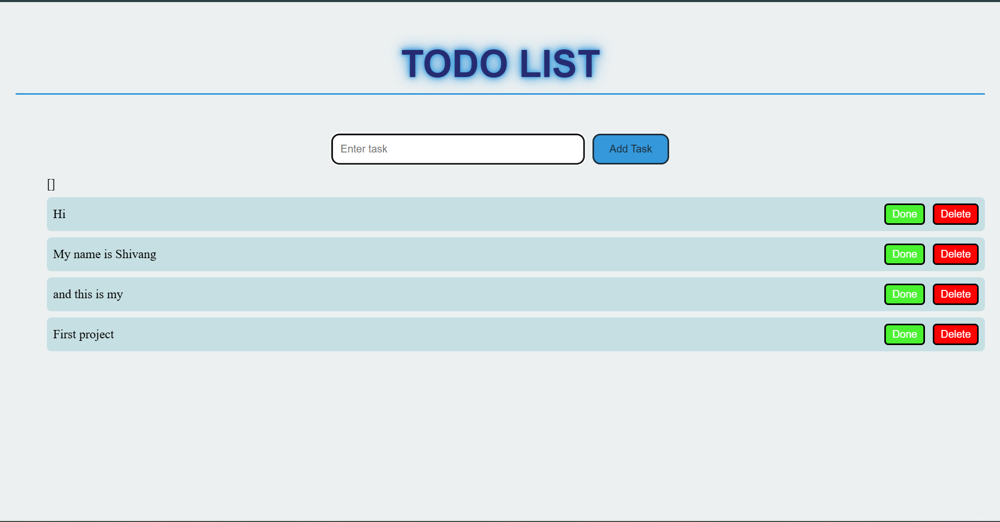

# Todo List App



A simple Todo List web application built using HTML, CSS, and JavaScript. Tasks are saved in the browser using **localStorage**, so they remain even after page refresh.

---

## Live Demo

[View Live App](https://shivangattri.github.io/ToDo-list-app/)

---

## Features

- Add tasks
- Delete tasks
- Mark tasks as completed
- Press **Enter** to add tasks
- Tasks saved using localStorage
- Tasks remain after page refresh

---

## Technologies Used

- HTML
- CSS
- JavaScript
- Browser localStorage

---

## How to Run Locally

1. Clone the repository:

```bash
git clone https://github.com/ShivangAttri/todo-list-app.git
## Author 
Shivang Attri